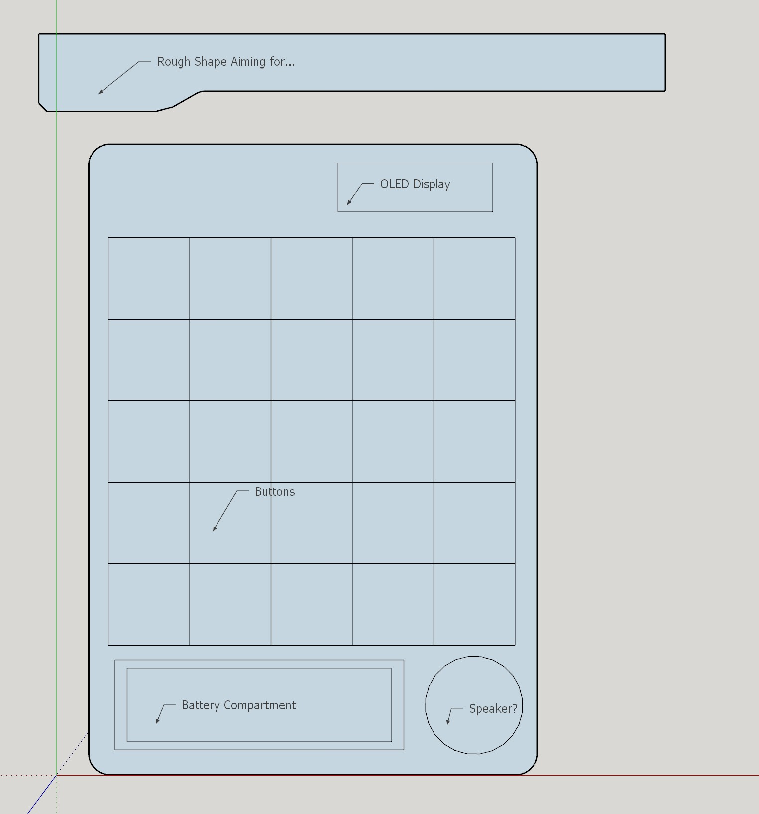

# Lights Out Physical project

## Started 20/04/2021

After I had completed creating LightsOut in Python, I was going to make it again with a GUI. I started this process but it sort of fizzled out (though I am sure I will go back to it).

I decided in my *great wisdom* to make a complete recreation of the game physically. The reasons for this are many, but overall I would like to achieve the following:
- Roughly design it
  - Have it use Batteries
  - Be able to charge it
  - Possibly have an additional display 
  - Add sound?
- Create the circuit
- Create the PCB (and have it manufactured)
- Write the software (ESP32)
- Creating a housing (maybe send off for 3D printing)

It's quite a lofty ambition, maybe not if you're experienced which I certainly am not, but I do hope to achieve it. 

Have brought so far:

|Qty.|Item|Price|
|--|--|--|
|60|SK6812 5050 RGB LEDs|£5.00|
|30|Gateron Switches Green (SMD Variant)|£9.45|
|1 | 15m Cat5e Cable (solid core)|£8.99|
|4 |Various pin connectors|£6.15|  
||added 01/05/2021...
|12|18650 Battery Holder|£6.99|
|5|1A/5V MicroUSB LiIon Battery Module|£6.99|
|1|60/40 Solder 100g|£6.37|
|1|1L Isopropanol 99.9%| £9.49|
||**Total**|**£59.43**|

## 01/05/2021

### Software
So I am starting to play around with the circuit idea. As I have never used addressable RGB led's before, I thought best to use an online simulator whilst I was waiting for them to arrive. (I will be using an ESP32 based board, however as I am just experimenting I am using an UNO online)


I have also done some rudimentary code along side this in the simulator to get a feel for how it works. So far I am just reading the colour of the LED, reporting it, and then changing it to another colour, rinse and repeat. I only plan to use green and red for this project.

```c++
#include <Adafruit_NeoPixel.h>

#define PIN		13
#define N_LEDS	25
 
Adafruit_NeoPixel strip = Adafruit_NeoPixel(N_LEDS, PIN, NEO_GRB + NEO_KHZ800);
//int req = 0;
//String hexer = "";
uint32_t red = strip.Color(255, 0, 0);
uint32_t green = strip.Color(0, 255, 0);
uint32_t active = green;
void setup()
{
  strip.begin();
  strip.show();
  Serial.begin(9600);
}

void loop()
{
  //(strip.Color(255, 0, 0)); // Red
  //(strip.Color(0, 255, 0)); // Green
  //(strip.Color(0, 0, 255)); // Blue
  strip.setPixelColor(2, active);
  strip.show();
  delay(1000);
  if (strip.getPixelColor(2) == green) {
    Serial.println("It's Green!");
    active = red;
  	strip.show();
  	}
  else {
    Serial.println("it's Red!");
    active = green;
  	strip.show();
	}

```

Next, in terms of software, I am going to work on the switch matrix and see how I can use them as a matrix.

### Design
I have also done a rough draft of what I think it will look like (completely not final). Obviously, there is a lot I need to change, but this was just to have an idea of where I am heading.
