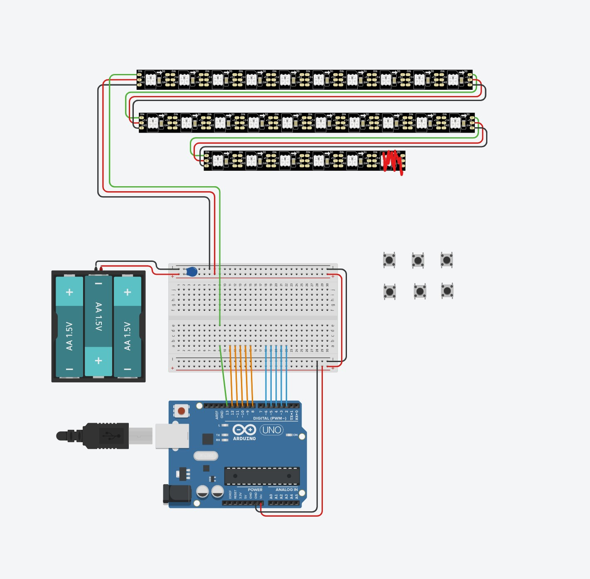
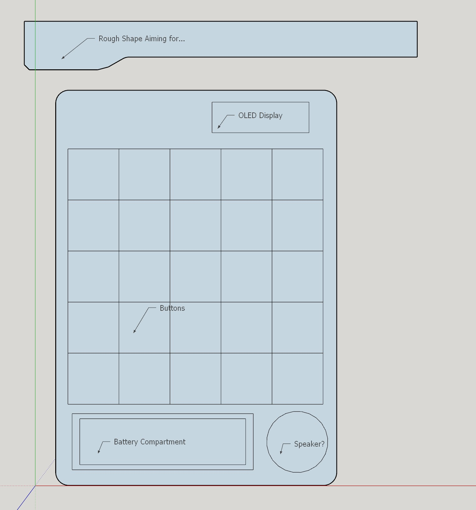
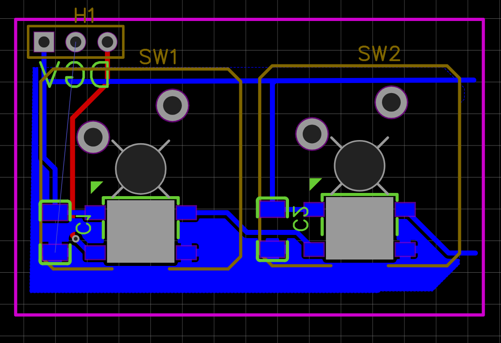
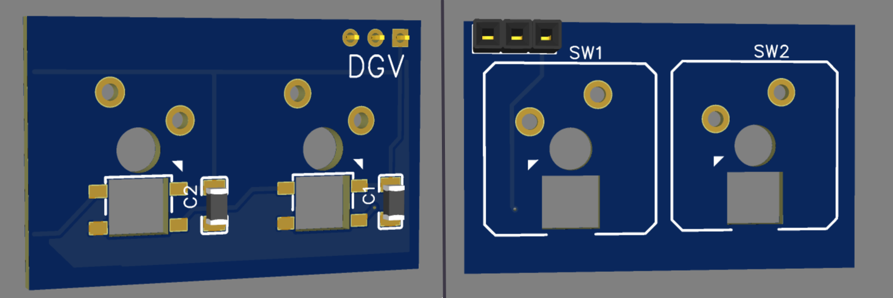
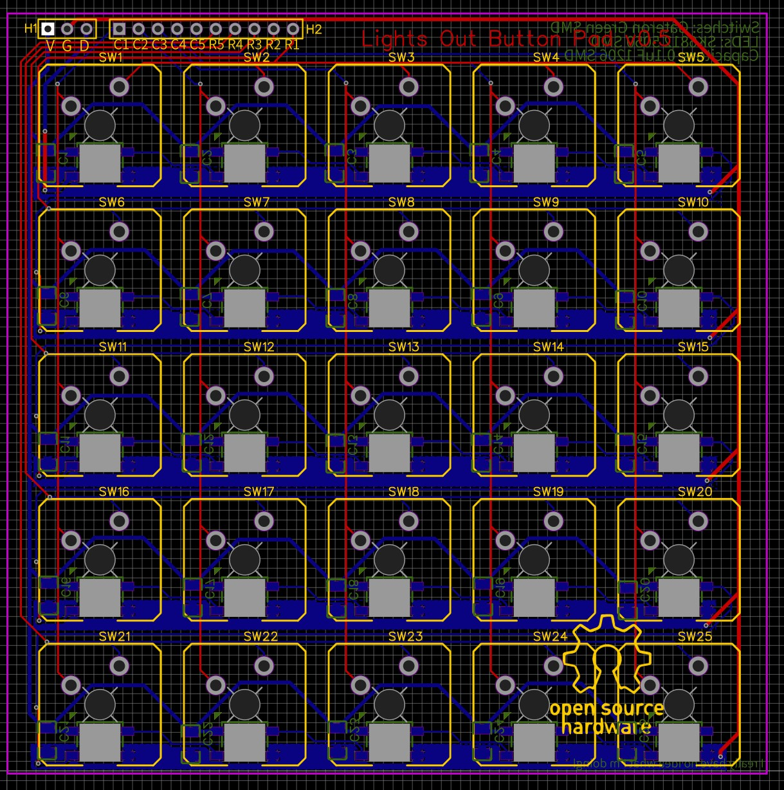
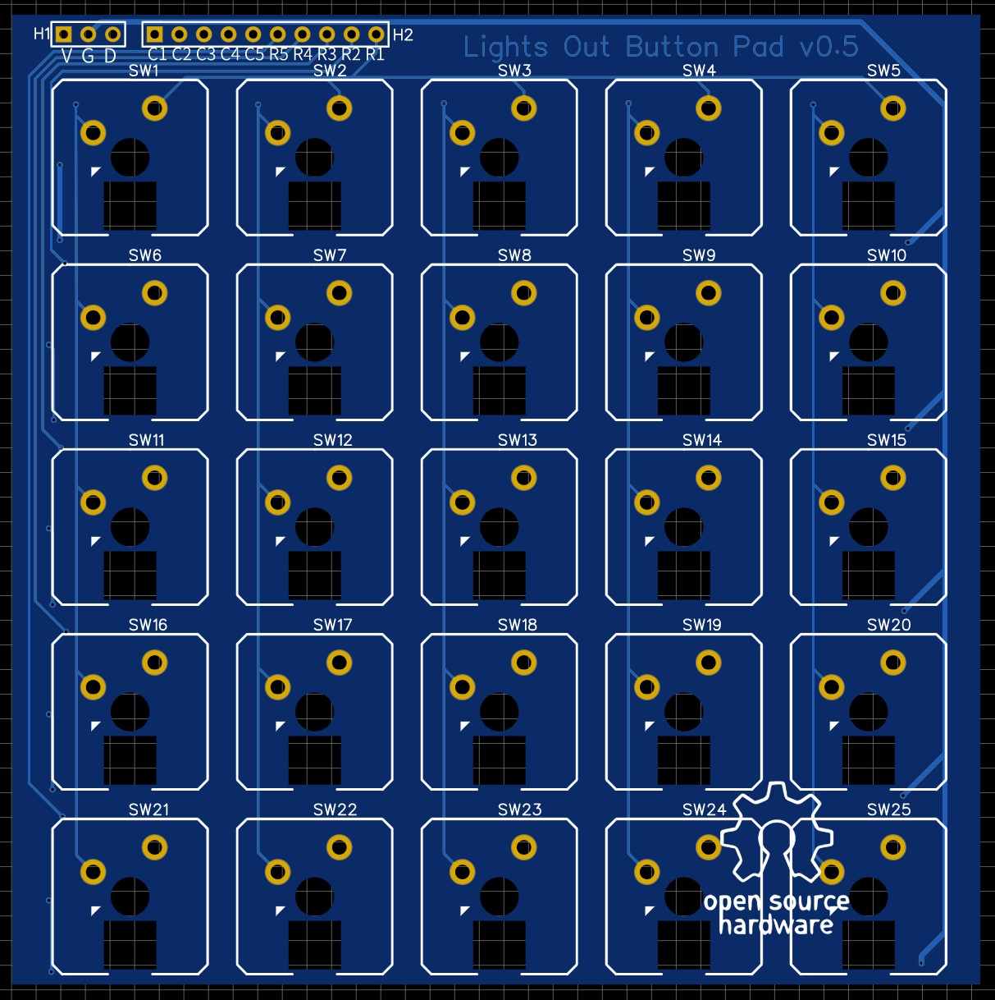
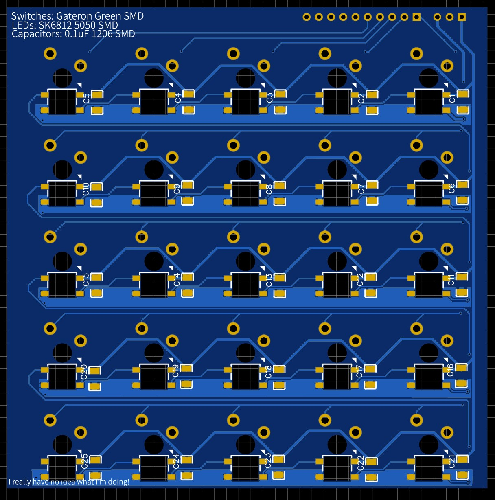
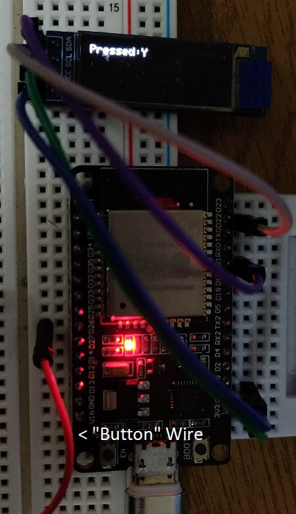

# Lights Out Physical project

- [Lights Out Physical project](#lights-out-physical-project)
  - [Intro](#intro)
  - [Edit 1](#edit-1)
    - [Items purchased so far:](#items-purchased-so-far)
    - [Dimensions of Items in mm](#dimensions-of-items-in-mm)
    - [Software](#software)
    - [Design](#design)
  - [Edit 2](#edit-2)
    - [PCB](#pcb)
  - [Edit 3](#edit-3)
  - [Edit 4](#edit-4)
    - [Button Layout](#button-layout)
    - [Serial Output](#serial-output)
- [Changes](#changes)

## Intro

After I had completed creating LightsOut in Python, I was going to make it again with a GUI. I started this process but it sort of fizzled out (though I am sure I will go back to it).

I decided in my *great wisdom* to make a complete recreation of the game physically. The reasons for this are many, but overall I would like to achieve the following:
- Roughly design it
  - Have it use Batteries
  - Be able to charge it
  - Possibly have an additional display 
  - Add sound?
- Create the circuit
- Create the PCB (and have it manufactured)
- Write the software (ESP32)
- Creating a housing (maybe send off for 3D printing)

It's quite a lofty ambition, maybe not if you're experienced which I certainly am not, but I do hope to achieve it. 

## Edit 1
### Items purchased so far:

This table will be updated as and when

|Qty.|Item|Price|Arrived|
|--|--|--|--|
|60|SK6812 5050 RGB LEDs|£5.00|Yes|
|30|Gateron Switches Green (SMD Variant)|£9.45|Yes|
|1 | 15m Cat5e Cable (solid core)|£8.99|No|
|4 |Various pin connectors|£6.15|No|  
|12|18650 Battery Holder|£6.99|Yes|
|5|1A/5V MicroUSB Li-Ion Battery Module|£6.99|Yes|
|1|60/40 Solder 100g|£6.37|Yes|
|1|1L Isopropanol 99.9%| £9.49|Yes|
|50| 0.1uF 1206 SMD Capacitors|£2.30|No|
||**Total**|**£61.73**||

### Dimensions of Items in mm

|Item Name|Length|Width|Height|
|--|--|--|--|
|SK6812 5050 RGB LEDs|5|5|1.6|
|Gateron Switches Green (SMD Variant)|15.8|15.6|18|
|18650 Battery Holder|75.9|20.9|18.5|
|1A/5V MicroUSB Li-Ion Battery Module|28.7|17.3|3.5|
|PCB|TBD|TBD|1.6|
|Capacitors|3.2|1.6|1|


### Software
So I am starting to play around with the circuit idea. As I have never used addressable RGB led's before, I thought best to use an online simulator whilst I was waiting for them to arrive. (I will be using an ESP32 based board, however as I am just experimenting I am using an UNO online)


I have also done some rudimentary code along side this in the simulator to get a feel for how it works. So far I am just reading the colour of the LED, reporting it, and then changing it to another colour, rinse and repeat. I only plan to use green and red for this project.

```c++
#include <Adafruit_NeoPixel.h>

#define PIN		13
#define N_LEDS	25
 
Adafruit_NeoPixel strip = Adafruit_NeoPixel(N_LEDS, PIN, NEO_GRB + NEO_KHZ800);
//int req = 0;
//String hexer = "";
uint32_t red = strip.Color(255, 0, 0);
uint32_t green = strip.Color(0, 255, 0);
uint32_t active = green;
void setup()
{
  strip.begin();
  strip.show();
  Serial.begin(9600);
}

void loop()
{
  //(strip.Color(255, 0, 0)); // Red
  //(strip.Color(0, 255, 0)); // Green
  //(strip.Color(0, 0, 255)); // Blue
  strip.setPixelColor(2, active);
  strip.show();
  delay(1000);
  if (strip.getPixelColor(2) == green) {
    Serial.println("It's Green!");
    active = red;
  	strip.show();
  	}
  else {
    Serial.println("it's Red!");
    active = green;
  	strip.show();
	}

```

Next, in terms of software, I am going to work on the switch matrix and see how I can use them as a matrix.

### Design
I have also done a rough draft of what I think it will look like (completely not final). Obviously, there is a lot I need to change, but this was just to have an idea of where I am heading.


## Edit 2

So I have been working on this a lot behind the scenes, but there has nothing of note really been done so far. Just a load of idea's on how to approach this. Thankfully some of the parts arrived today, so I have been able to measure and imagine how large the pcb needs to be etc. On top of that, I have also been working on a few PCB ideas. 

### PCB
I think I have figured out the best way to approach it (Capacitors got in the way of progress there) and have two switches plotted and wired up below:



The blue traces are on the underside of the board. I have managed to put all of the traces for the LEDs on this side, which will make routing the row and columns for the switches (red traces) much easier. 

## Edit 3

So I have finally made the first PCB. It took far too long, but it isn't something I am a professional at. This is of the button pad (which was the hardest to design (I think)), and I know I probably made so many errors, but I completed it. I have sent it off for manufacture at just over £7, so I am not too worried if it doesn't work. At least I will have something physical and then I can progress from there. I think I will leave it here for today.




## Edit 4

A lot of progress has been made today in terms of software. I have successfully managed to get it to the point of playing a level (displaying through the Serial Monitor), at the same time displaying what "button" has been pressed on a small screen. I am currently just joining assigned rows and columns together with a wire to simulate the button. So far the software can:
- Set up communications between it and the OLED display
- Read a level array and load it into its working array
- Calculate the sum of all "lights" that are on
- When that sum = 0, move out of the loop and on to the next level (need to populate those, yet)
- Display the "button" that was pressed on the small display
- Out put the board to the serial console (no light array yet)

I have decided to include the Arduino code into this repository now, so I don't forget to add it later. I'm really quite happy with how far I progressed today.

>Yes, I am fully aware that there is probably a much better way to handle the simple task I am trying to accomplish. I am not trying to copy anyone's ideas though, so I am just trying to make it work in what would make logical sense to me.



### Button Layout

|Col/Row|1|2|3|4|5|
|1|A|B|C|D|E|
|2|F|G|H|I|J|
|3|K|L|M|N|O|
|4|P|Q|R|S|T|
|5|U|V|W|X|Y|

### Serial Output
```
Level: 1
00000   
00000
00000
10101
10101
U //'button' pressed
Going into routine
Level: 1
00000
00000
00000
00101
01101
Tot. On: 5
W
Going into routine
Level: 1
00000
00000
00000
00001
00011
Tot. On: 3
Y
Going into routine
Level: 1
00000
00000
00000
00000
00000
Tot. On: 1
Level Complete!!!

Level: 2
00000
00000
00000
10101
10101
```

# Changes
- 31/04/2021
   - Initial Creation
   - Added price list
- 01/05/2021
   - Added Intro
   - Added battery holders, power boards and misc to price list
   - Added Dimensions table
   - Software notes
   - Design Notes
- 05/05/2021
   - Added PCB ideas
   - Items arrived
   - Added Capacitors to price list/dimensions
- 06/05/2021
   - Finally completed a PCB (1 of *n*) and sent off for manufacture
- 07/05/2021
  - Added software and made great progress!
